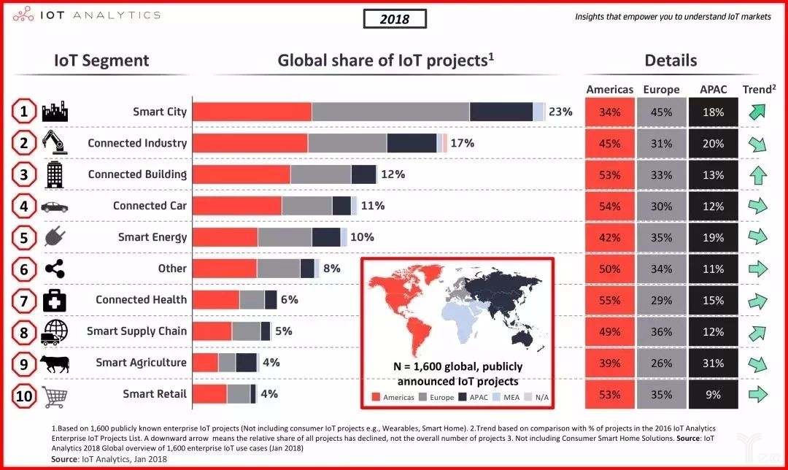

## IoT Analytics报告丨2023年，物联网平台的年度支出将超过220亿美元
本文转载自公众号“物联网智库”，物联网智库编译整理原文内容来自研究机构IoT Analytics近日发布的两份关于物联网平台的报告：一份题为《物联网平台市场报告2018-2023》（193页），另一份题为《2018物联网平台供应商对比》（450页）。

《物联网平台市场报告2018-2023》揭示，从2018年到2023年，物联网平台领域的软件和服务支出预计将以每年39%的年复合增长率高速增长，到2023年，物联网平台领域的年度支出将超过220亿美元。《2018物联网平台供应商对比》指出，物联网平台领域的供应商分布依然呈现碎片化的特点，但第一梯队的玩家正在成型。其中，微软和PTC分别被评为云平台和应用使能平台领域的物联网平台领先供应商。

### 关于物联网平台市场
《物联网平台市场报告2018-2023》揭示，随着越来越多的企业将“转型成为一家物联网数据驱动的公司”作为企业的高优先级战略，物联网平台市场将在2018年加速发展。

从数据来看，从2018年到2023年，物联网平台领域的软件和服务支出预计将以每年39%的年复合增长率高速增长，到2023年，物联网平台领域的年度支出将超过220亿美元。

这些数据是基于物联网平台领域相关领先企业的收入，涉及11个不同的行业部门（农业、智慧楼宇、车联网、能源、医疗、制造业、公共服务、零售、智慧供应链、物流及其它）。

在研究中，物联网平台市场被划分为：

7大地区（亚洲、欧洲、北美、MEA、南美洲、大洋洲和其它地区）

5大平台类型（云平台、应用使能平台、设备管理平台、连接平台、高级分析平台）

4种部署类型（本地部署、托管于私有云、混合云、公有云）

2种收入类型（平台软件销售和服务销售）。

去年年中，IoT Analytics曾更新过一版物联网平台报告，报告指出，全球范围内的物联网平台企业已经由2015年的260家、2016年的350家增长至2017年的450家。

今年3月，IoT Analytics对1600个在企业中实际运行的物联网项目进行了整合、验证和分类，发布了“2018 Top物联网项目排名”。

### 客户如何选择他们的物联网平台？
除了以上的数据，报告着重举了几个客户如何选择他们物联网平台的例子。

例如，德国的一家汽车OEM供应商预选了十家物联网平台供应商，并邀请他们在实际生产环境中进行为期两天的PoC测试（即根据用户对采用系统提出的性能要求和扩展需求的指标，在选用服务器上进行真实数据的运行，对承载用户数据量和运行时间进行实际测算，并根据用户未来业务扩展的需求加大数据量以验证系统和平台的承载能力和性能变化）。

客户使用一系列的测试标准对供应商在工业现场的连接设备进行评估，比如基础设施、网络、物联网、分析、管理服务、安全性和合作伙伴生态系统（每个项目可能有相应的加权数）。

在这之后，客户选取最好的两个供应商并再次进行为期3个月的PoC测试并进一步对他们的能力进行排名。

最后，由参与了PoC的物联网团队给出建议，工厂自动化团队的领导作出最终决策。

### 物联网平台供应商
《2018物联网平台供应商对比》指出，物联网平台领域的供应商分布依然呈现碎片化的特点，但第一梯队的玩家正在成型。

这份报告还发现，大多数平台都有自己强大的合作伙伴生态系统。在分析的21家企业中，其中16家都制定了自己的合作伙伴计划，20家则参加了物联网联盟和标准化组织。在这些合作关系中，最多数量来自于系统集成商（30%）。

报告中涉及的物联网平台供应商包括：埃森哲、ADAMOS、亚马逊网络服务、博世、C3 IoT、Device Insight、通用电气、日立、华为、IBM、Kaa IoT、微软、Mnubo、PTC、SAP、施耐德电气、Seluxit、西门子、Sierra Wireless、Software AG、Telit。

其中，微软和PTC分别被评为云平台和应用使能平台领域的物联网平台领先供应商。

下面，对这两家平台的资料进行简要介绍：

微软的Azure IoT

公司：Microsoft

名称：Microsoft Azure IoT

Azure 是一个综合性云服务平台，开发人员和IT专业人士可通过我们的全球数据中心网络使用该平台来生成、部署和管理应用程序。集成工具、DevOps和Marketplace支持高效生成任何内容。其中IoT套件架构在Azure之上，可帮助客户加速物联网解决方案的开发。

迅速连接，高效扩展：使用适用于多个平台（包括Linux、Windows和实时操作系统）的设备SDK添加新设备并连接现有设备。无论你的项目大小，都可从少数几个传感器轻松扩展至数百万台同步连接的设备，并依赖Azure的全球可用性。

分析并处理数据：从设备和传感器收集以前未使用的数据，并使用内置功能显示并处理该数据。以灵活、可扩展的高性能方法使用基于SQL的语法来设置实时分析，而无需管理复杂的基础结构和软件。使用大型算法库来扩展预测分析解决方案。将 R 和 Python 语言中的代码直接集成到你的工作区中，从而扩展实时分析和机器学习解决方案。

集成并转换业务：AzureIoT可与第三方应用程序（包括Salesforce、SAP、Oracle Database 和 MicrosoftDynamics）轻松集成，轻松访问数据并使分散的系统保持最新。只需极少的开发工作即可通过移动推送通知引擎将数百万消息发送给异构设备。生成与Microsoft和第三方Web API相集成的移动和Web应用程序，并使用OAuth2.0生成自己的安全WebAPI。

设备身份验证：为每个连接的设备设置标识和凭据，并帮助保持云到设备和设备到云消息的保密性。并且，选择性地撤消特定设备的访问权限以保持系统的完整性。

公司：PTC

名称：ThingWorx

PTC ThingWorx是一款专门为物联网应用量身定制的、完整的、端到端的技术平台。它使得物联网应用程序开发者可以快速连接、创建以及部署企业级的物联网应用。ThingWorx Foundation连接了ThingWorx的所有组件，提供了开发者创建完整物联网应用最简单的路径。

Thingworx AEP平台功能及亮点：

1）“拖拽式”聚合页面构建器，ThingWorx“拖拽式”聚合页面构建器使用户快速创建富应用，缩短开发时间，聚合页面构建器生成的是纯HTML应用程序，完全支持安卓设备和iOS设备。

2）提供SQUEAL工具，客户通过SQUEAL的交互式搜索能力，从数据中找到业务关键问题的答案

3）提供REST APIs，第三方系统可以通过REST APIs和ThingWorx平台进行交互和集成

4）提供建模环境和业务逻辑，ThingWorxComposer是为创建应用程序而设计的一个端到端的应用程序建模环境。在Composer中，开发者可以为互联应用程序所必需的“物”、业务逻辑、可视化、数据存储、协同和安全等建模

5）提供嵌入式数据库，可进行数据存储
